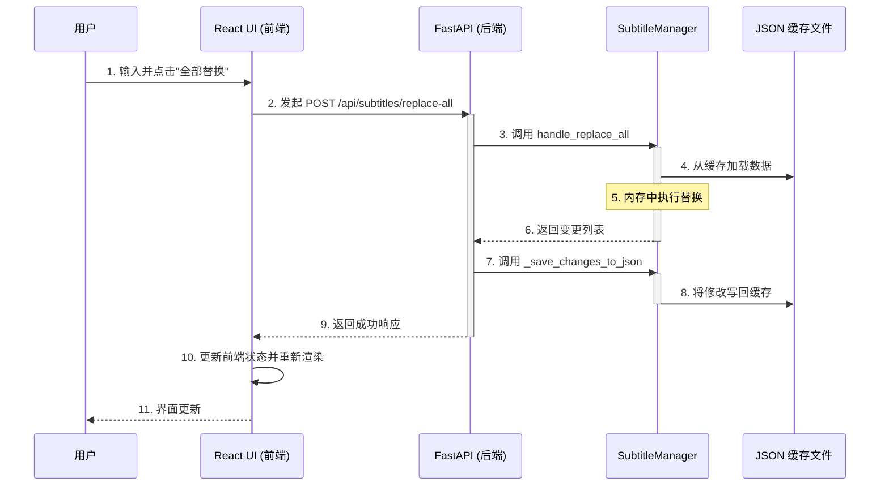
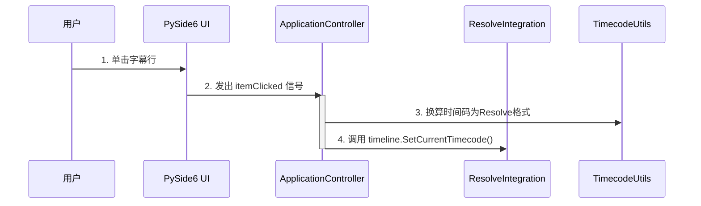

# 项目知识库: Subvigator Next

---

## 1. 项目概述 (Project Overview)

### 1.1 目标与愿景

**Subvigator Next** 是一个旨在革新视频剪辑中字幕处理工作流的专业工具，其核心目标是为 DaVinci Resolve 用户提供一个远超原生字幕功能的、高效且功能强大的字幕编辑器。

项目通过以下方式实现其价值：

*   **性能优化：** 解决了直接在 DaVinci Resolve 中处理大量字幕时（超过200条）出现的严重性能瓶颈。通过实现一套智能缓存机制，Subvigator 允许用户在外部编辑器中流畅地浏览和修改成百上千条字幕，而无需忍受 Resolve 的延迟。
*   **功能增强：** 提供了 Resolve 原生编辑器所缺乏的关键功能，例如高级查找与替换、批量SRT导入/导出等。
*   **现代化架构演进：** 本项目不仅是一个功能工具，更是一个技术演进的范例。它正在从一个基于 PySide6 的传统单体桌面应用，重构为一个采用 **FastAPI (后端) + React/Tauri (前端)** 的现代化、前后端分离的架构。

### 1.2 目标用户

*   **专业视频剪辑师**
*   **内容创作者/Youtuber**
*   **字幕组/翻译团队**

### 1.3 技术栈概览

*   **后端:** Python 3, FastAPI, `DaVinciResolveScript`
*   **前端:** TypeScript, React (Vite), Tauri (Rust)
*   **UI/状态管理:** Shadcn/UI, Tailwind CSS, Zustand, TanStack Query
*   **核心依赖:** `pydantic`, `timecode`

---

## 2. 架构设计 (Architecture Design)

> ⚠️ **重要提示：** 本章节描述的是项目 **未来的目标架构**，旨在指导重构工作。它 **不反映** 当前生产系统的实际实现。

### 2.1 核心理念与决策 (Core Philosophy & ADRs)

#### 核心理念：从单体到分离的演进

项目架构的核心驱动力是 **从紧耦合的单体桌面应用向现代化、前后端分离的模式演进**。这一决策旨在解决原架构在可维护性、性能和用户体验方面的挑战。新架构将应用彻底拆分为两个独立的部分：一个纯粹的、无UI的 **FastAPI后端**，和一个现代化的 **Tauri + React前端**。这种分离带来了 **解耦** 的核心优势，使得前后端可以独立开发、测试和部署。

#### ADR-001: 选择 FastAPI 作为后端框架

*   **决策:** 选择 FastAPI。
*   **理由:** 高性能、高开发效率（自动API文档）、强大的依赖注入系统和原生异步支持。

#### ADR-002: 选择 Tauri 作为桌面应用容器

*   **决策:** 选择 Tauri，而不是 Electron。
*   **理由:** 轻量与高性能（使用原生WebView）、高安全性（Rust核心和严格的API授权）以及对Sidecar模式的原生支持。

#### ADR-003: 完整保留 `SubtitleManager` 的缓存与 `is_dirty` 机制

*   **决策:** 在重构到FastAPI后端时，必须完整、忠实地迁移并保留 `subtitle_manager.py` 中现有的文件缓存和 `is_dirty` 状态跟踪机制。
*   **理由:** 这是整个应用高性能和数据安全的基石，通过**缓存优先**策略避免慢速API调用，并通过**脏标记**防止用户数据意外丢失。

### 2.2 目标架构详解 (Target Architecture)

```mermaid
graph TD
    subgraph "用户桌面环境"
        subgraph "Tauri 应用"
            direction LR
            subgraph "Rust 核心 (Tauri Main Process)"
                TauriCore[Tauri Core] -- 管理生命周期/配置 --> FastAPIProcess(FastAPI 子进程)
                TauriCore -- 提供原生API --> Frontend
            end

            subgraph "前端 (WebView)"
                Frontend[React UI] -- HTTP API 请求 --> FastAPIProcess
                Frontend[React UI] -- WebSocket 双向通信 --> FastAPIProcess
            end
        end

        subgraph "DaVinci Resolve 环境"
            Resolve[DaVinci Resolve]
        end
    end

    subgraph "后端服务 (在Tauri子进程中运行)"
        direction TB
        FastAPIProcess -- Python脚本API --> Resolve
        FastAPIProcess -- 提供RESTful API --> Frontend
        FastAPIProcess -- 封装 --> BusinessLogic[业务逻辑 (原services.py)]
        BusinessLogic -- 依赖 --> SubtitleManager[字幕管理 (subtitle_manager.py)]
        BusinessLogic -- 依赖 --> ResolveIntegration[Resolve集成 (resolve_integration.py)]
        BusinessLogic -- 依赖 --> FormatConverter[格式转换 (format_converter.py)]
    end

    style Frontend fill:#cde4ff
    style TauriCore fill:#f9f,stroke:#333,stroke-width:2px
    style FastAPIProcess fill:#ffc,stroke:#333,stroke-width:2px
    style Resolve fill:#bbf,stroke:#333,stroke-width:2px
```

*   **Tauri Core (Rust):** 应用生命周期管理器、进程“保姆”（管理FastAPI子进程）和原生API桥梁。
*   **React UI (JavaScript/TypeScript):** 唯一的UI层，API的消费者。
*   **FastAPI 子进程 (Python):** 无头业务逻辑核心，API的提供者，Resolve的直接对话者。

### 2.3 API 端点定义 (API Endpoints)

#### Timeline API (`/api/timeline`)
*   `GET /tracks`: 获取所有可用的字幕轨道列表。
*   `GET /info`: 获取当前时间线信息（帧率，起始时间码等）。
*   `POST /set-timecode`: 在 DaVinci Resolve 中定位播放头。

#### Subtitles API (`/api/subtitles`)
*   `GET /{track_id}`: 获取指定轨道的所有字幕。
*   `PUT /{track_id}/{subtitle_id}`: 更新单个字幕的文本内容。
*   `POST /replace-all`: 在当前轨道执行“全部替换”。
*   `POST /import-srt`: 通过上传 SRT 文件内容来导入字幕。
*   `POST /export-srt/{track_id}`: 导出指定轨道的字幕为 SRT 文件。
*   `POST /reimport-to-resolve`: 将当前缓存的字幕重新导入到达芬奇。

#### Status API (`/api/status`)
*   `GET /is-dirty`: 检查当前是否有未保存的修改。(建议通过 WebSocket 主动推送)

#### WebSocket API (`/api/ws`)
*   `WS /connect`: 建立一个 WebSocket 连接，用于状态的实时推送。

### 2.4 Pydantic 数据模型 (Pydantic Models)

```python
# backend/app/models/subtitle.py
from pydantic import BaseModel
from typing import List, Optional

class Subtitle(BaseModel):
    id: int
    text: str
    start_timecode: str
    end_timecode: str
    start_frames: int
    end_frames: int

class ReplaceRequest(BaseModel):
    find_text: str
    replace_text: str
    case_sensitive: bool

# ... 其他模型如 Track, TimelineInfo 等 ...
```

---

## 3. 现有代码实现分析 (Analysis of Current Implementation)

本章深入剖析当前 `src` 目录下的代码实现，作为理解系统现状和指导重构工作的基础。

### 3.1 核心模块

*   **字幕管理器 (`subtitle_manager.py`):** 应用的数据心脏，通过**缓存优先的懒加载**和**`is_dirty`脏状态跟踪**实现高性能和数据安全。
*   **Resolve 集成器 (`resolve_integration.py`):** 应用与 DaVinci Resolve 之间的唯一桥梁，封装了所有底层的脚本 API 调用。

#### 深度解析: `reimport_from_json_file`

此功能是保证用户修改能够安全返回 DaVinci Resolve 的核心。它通过 `JSON -> SRT -> 临时文件 -> 媒体池 -> 新轨道` 这一系列操作，巧妙地绕过了 Resolve API 在直接、批量修改字幕方面的限制，并通过创建新轨道的方式保证了操作的安全性。

### 3.2 工具模块

*   **`FormatConverter` (`format_converter.py`):** 负责 SRT 格式字符串与项目内部JSON数据结构之间的双向转换，是导入/导出功能的基石。
*   **`TimecodeUtils` (`timecode_utils.py`):** 封装了所有与时间码相关的复杂计算，是保证时间精度和代码可维护性的关键。

### 3.3 数据流分析

#### 业务流程: "查找并全部替换"


#### 业务流程: "点击跳转时间码"


---

## 4. 开发与贡献 (Development & Contribution)

### 4.1 环境搭建与部署

为了简化开发流程，我们配置了一个集成的启动命令。在 `frontend/subvigator-next` 目录下运行：
    ```bash
    npm run start:dev
    ```
这个命令会使用 `concurrently` 工具同时启动 FastAPI 后端和 Tauri 前端开发服务器，并把它们的输出汇总到同一个终端中，非常方便！

(原有的详细后端和前端分离的开发环境搭建步骤，以及最终通过 PyInstaller 和 Tauri Bundler 打包部署的完整流程依然保留，作为分步操作的参考。)

### 4.2 代码规范与贡献指南

(内容来自于 `knowledge_base.md`，定义了后端的 PEP 8/Black 规范，前端的 Prettier 规范，以及基于 GitHub Flow 的分支与合并策略。)

---

## 5. 重构路线图 (Refactoring Roadmap)

> **注意:** 此路线图旨在确保重构过程平稳、可控且风险最低。

### 阶段 0: 环境搭建与项目初始化 (1-2天)
*   **目标:** 创建项目骨架，验证 Tauri, React, FastAPI 三者之间最基础的通信。
*   **里程碑:** 应用可以成功启动，前端能够从后端获取"Hello World"数据。

### 阶段 1: 后端 API 开发 (使用模拟数据) (5-7天)
*   **目标:** 完全实现 FastAPI 的所有 API 端点，但暂时不与 DaVinci Resolve 交互，而是使用模拟数据。
*   **里程碑:** 一个功能完整的、但与 Resolve 解耦的后端 API 开发完成，并有Swagger UI文档。

### 阶段 2: 前端 UI 开发 (3-5天)
*   **目标:** 基于第一阶段完成的后端 API，开发一个功能完整的用户界面。
*   **里程碑:** 用户界面开发完成，所有功能在连接模拟后端的情况下均可正常工作。

### 阶段 3: 后端与 Resolve 集成 (2-3天)
*   **目标:** 将后端的模拟数据层替换为与 DaVinci Resolve 的真实交互。
*   **里程碑:** 后端现在可以与 DaVinci Resolve 进行完整的、真实的交互。

### 阶段 4: 端到端集成与测试 (2-3天)
*   **目标:** 将开发完成的前端与已经连接到 Resolve 的后端进行联调，并修复所有问题。
*   **里程碑:** 一个功能完整、稳定且通过端到端测试的应用程序。

### 阶段 5: 打包与分发 (1-2天)
*   **目标:** 将应用打包成可供最终用户使用的、跨平台的分发包。
*   **里程碑:** 生成最终的可分发产品。