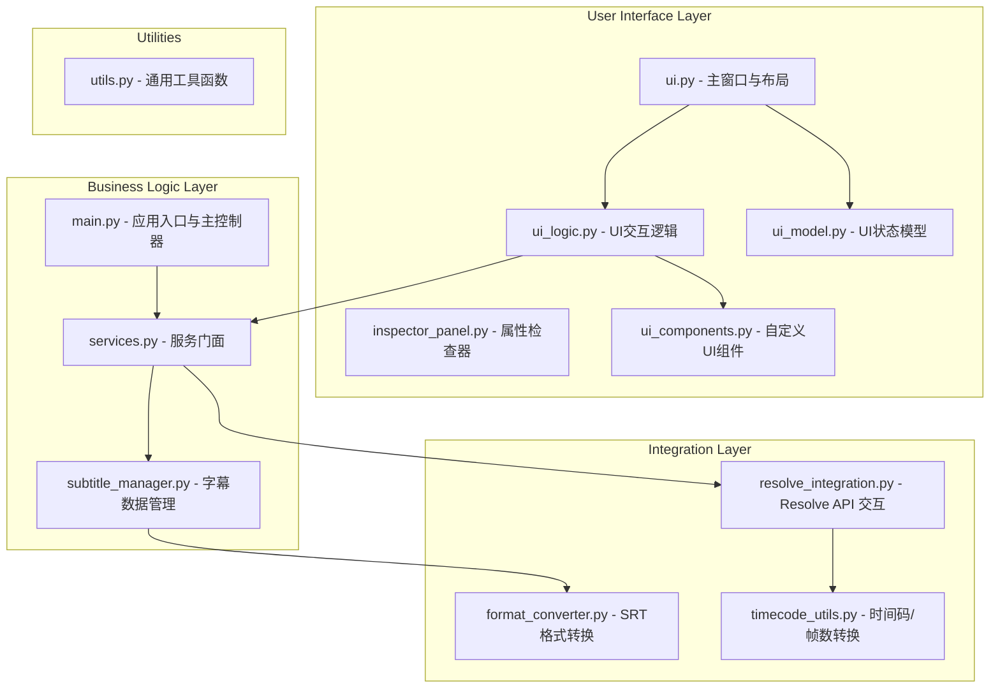

# DaVinci Resolve 字幕插件知识文档

本文档旨在深入分析字幕插件的源代码，阐明其架构、模块功能和实现原理，为项目后续的维护和重构提供技术支持。

## 1. 项目概述

本插件是一个集成在 DaVinci Resolve 中的字幕编辑工具，通过提供一个独立的UI界面，扩展了 Resolve 原生的字幕处理能力。其核心功能包括：

*   **实时获取与预览**：从 DaVinci Resolve 的时间线字幕轨道中实时抓取字幕数据。
*   **高效编辑**：提供强大的文本查找、替换、筛选功能。
*   **格式兼容**：支持 SRT 格式的导入和导出，便于与其他工具协同工作。
*   **无缝回写**：将修改后的字幕数据安全、准确地回写到 Resolve 时间线。

## 2. 架构总览

插件采用分层架构，将 UI、业务逻辑和与 DaVinci Resolve 的集成清晰地分离开来，便于独立开发和测试。

## 3. 模块详解

### 3.1. 核心集成与数据管理

*   **`resolve_integration.py`**: 作为与 DaVinci Resolve API 交互的桥梁，封装了所有底层的硬件/软件通信。它负责动态加载 Resolve 的脚本库，获取时间线、轨道和字幕数据，并执行最关键的**非破坏性回写**操作——通过创建临时 SRT 文件并将其导入到新的字幕轨道，从而保证原数据的安全。

    **Resolve 对象和 API 使用详情:**
    - **`fusionscript` 动态加载**: 脚本通过 `importlib.import_module('fusionscript')` 动态加载 Resolve 的核心脚本库。
    - **Resolve 对象获取**: 通过 `fusionscript.scriptapp("Resolve")` 获取 Resolve 主应用程序对象。
    - **项目和时间线管理**:
        - `resolve.GetProjectManager().GetCurrentProject()`: 获取当前活动项目。
        - `project.GetCurrentTimeline()`: 获取当前活动时间线。
    - **字幕轨道和数据交互**:
        - `timeline.GetTrackCount("subtitle")`: 获取字幕轨道的数量。
        - `timeline.GetTrackName("subtitle", i)`: 获取指定索引的字幕轨道名称。
        - `timeline.GetItemListInTrack("subtitle", i)`: 获取轨道中的所有字幕项，这是数据提取的核心。
        - `item.GetFusionCompByName(item.GetName())`: 获取字幕项的 Fusion 合成。
        - `comp.GetToolList()`: 获取合成中的工具列表，用于访问字幕内容。
    - **SRT 导入/导出**:
        - `project.ImportTimelineFromFile(temp_srt_path)`: 将 SRT 文件作为新时间线导入。
        - `timeline.Export(temp_srt_path, resolve.EXPORT_FORMAT_SRT, resolve.EXPORT_SUBTITLE_MODE_INDIVIDUAL)`: 将时间线导出为 SRT 文件。
    - **非破坏性回写实现**:
        1.  通过 `Export` 方法将当前字幕轨道导出为临时的 SRT 文件。
        2.  使用 `ImportTimelineFromFile` 将该 SRT 文件导入为一个新的临时时间线。
        3.  从这个新时间线中提取字幕项，并将其插入到目标轨道，同时清除原字幕。
        4.  删除临时时间线，完成安全回写。

*   **`subtitle_manager.py`**: 字幕数据的核心管理器。它设计了一套高效的**文件缓存机制**，将从 Resolve 获取的字幕数据以 JSON 格式缓存在本地，避免了频繁的 API 调用，极大地提升了性能。同时，它通过 `is_dirty` 标志位实现**延迟写入**策略，管理数据的修改状态，确保了操作的流畅性和数据的完整性。
*   **`services.py`**: 应用的服务层，采用**门面模式 (Facade Pattern)**，为上层 UI 控制器提供了简洁、面向业务的接口。它封装了 `resolve_integration` 和 `subtitle_manager` 之间的复杂交互流程（如切换轨道、导出回写、导入文件等），并通过**依赖注入**的方式保持了模块间的解耦，提高了代码的可测试性和可维护性。

### 3.2. 应用主控与入口
*   **`main.py`**: 应用程序的入口点，负责初始化UI、服务和所有核心组件。它创建了 `MainController`，并将其与 `SubvigatorWindow` 连接，协调整个应用的数据流和用户交互。

### 3.3. UI 界面与布局

*   **`ui.py`**: 定义了应用的主窗口 `SubvigatorWindow`，负责整体布局，包括字幕表格、筛选器和功能面板。
    - **UI 组件**: 主要使用 `PySide6.QtWidgets` 中的标准组件，如 `QMainWindow`, `QTableView`, `QLineEdit`。
    - **自定义组件集成**: 集成了来自 `ui_components.py` 的 `SubtitleTableView` 和 `FilterLineEdit`，以及来自 `inspector_panel.py` 的 `InspectorPanel`。
*   **`inspector_panel.py`**: 封装了右侧的功能面板，包含批量操作（如查找替换、大小写转换）的UI元素。
*   **`ui_components.py`**: 提供了高度定制化的UI组件。
    - **`SubtitleTableView`**: 继承自 `QTableView`，实现了自定义的委托 `SubtitleDelegate`，用于渲染富文本（如高亮显示差异）。
    - **`SubtitleDelegate`**: 继承自 `QStyledItemDelegate`，重写了 `paint` 方法，以支持基于 `difflib` 计算结果的HTML渲染。

### 3.4. UI 逻辑与模型

*   **`ui_logic.py`**: 将复杂的UI交互逻辑抽离为一系列**无状态的纯函数**。
    - **信号与槽 (Signals & Slots)**: UI交互的核心。例如，`FilterLineEdit` 的 `textChanged` 信号连接到 `MainController` 的槽函数，触发字幕过滤。
    - **数据模型**: 使用 `PySide6.QtCore.QAbstractTableModel` 的子类 `SubtitleModel` 作为 `QTableView` 的数据源，实现了UI与数据的解耦。
    - **差异计算**: 查找替换功能的核心是 `difflib.SequenceMatcher`，它被用来计算原始文本和修改后文本之间的差异，并通过 `SubtitleDelegate` 在UI上高亮显示。
*   **`ui_model.py`**: 使用 `@dataclass` 定义了一个简单的UI状态容器 `UIState`，用于存储UI的当前状态，如选中的行、筛选关键词等。

### 3.5. 格式转换与工具

*   **`format_converter.py`**: 负责在应用内部数据结构（`SubtitleItem` 列表）和标准 SRT 格式之间进行双向转换。
*   **`timecode_utils.py`**: 项目中技术最复杂的模块，通过 `cffi` 动态调用 DaVinci Resolve 自带的 FFmpeg `avutil` 库，实现了工业级精度的时间码与帧数互转。
    - **CFFI 交互**: 使用 `cffi.FFI()` 创建一个 Foreign Function Interface 实例。
    - **FFmpeg `avutil` 库加载**:
        - 首先尝试在 Resolve 的 `libs` 目录下定位 `avutil.dll` 或 `libavutil.so`。
        - 如果失败，则在系统的 `PATH` 环境变量中搜索。
    - **核心函数调用**:
        - `avutil.av_get_time_base_q()`: 获取 FFmpeg 内部默认的时间基准（`{1, 1000000}`），用于高精度时间计算。
        - `avutil.av_rescale_q(pts, tb_src, tb_dst)`: 在不同的时间基准之间重新缩放时间戳（PTS），这是时间码与帧数转换的核心。
    - **后备方案**: 如果 `avutil` 库加载失败，模块会回退到一个纯 Python 实现的 `timecode_to_frames_fallback` 函数，该函数基于固定的帧率（24 FPS）进行估算，以保证基本功能的可用性。
*   **`utils.py`**: 通用工具模块，包含文件操作、日志记录等辅助函数。

## 4. 核心流程分析

### 4.1. 启动与数据加载
1.  `main.py` 启动，初始化 `MainController`。
2.  `MainController` 调用 `services.get_timeline_names()`。
3.  `services` 委托 `resolve_integration.get_timeline_names()` 与 Resolve 通信，获取字幕轨道列表。
4.  UI 将轨道列表展示在下拉菜单中。
5.  用户选择一个轨道，触发 `services.switch_track()`。
6.  `services` 调用 `resolve_integration.get_subtitle_items()` 从 Resolve 获取字幕数据。
7.  获取的数据被传递给 `subtitle_manager`，后者将其缓存到本地 JSON 文件中。
8.  `subtitle_manager` 将数据加载到内存，并通过 `SubtitleModel` 更新到 `QTableView` 中。

### 4.2. 字幕编辑与回写
1.  用户在 `QTableView` 中编辑字幕。
2.  `SubtitleModel` 捕捉到数据变更，将 `subtitle_manager` 的 `is_dirty` 标志位设为 `True`。
3.  用户点击“回写”按钮。
4.  `MainController` 调用 `services.write_back_to_resolve()`。
5.  `services` 从 `subtitle_manager` 获取脏数据。
6.  `services` 调用 `resolve_integration.write_subtitles()`，执行非破坏性回写流程。
7.  回写完成后，`is_dirty` 标志位被重置为 `False`。

## 5. 重构建议

*   **状态管理**: 当前的 `UIState` 和 `is_dirty` 标志虽然有效，但在更复杂的场景下可能变得脆弱。可以考虑引入更成熟的状态管理模式（如 Redux-like 或 Signals）。
*   **异步操作**: 与 Resolve 的通信是同步阻塞的，在处理大量数据时可能导致UI卡顿。应将其重构为异步操作（例如使用 `QThread`），并通过信号与主线程通信。
*   **依赖管理**: `services` 模块的依赖注入是手动实现的。可以引入一个轻量级的依赖注入框架（如 `dependency-injector`）来自动化管理。
*   **错误处理**: 完善与 Resolve API 交互时的错误捕获和用户提示，例如在 Resolve 未运行或时间线无字幕时给出明确反馈。
*   **测试覆盖**: 增加对 `services` 和 `ui_logic` 模块的单元测试覆盖率，确保业务逻辑的正确性。
