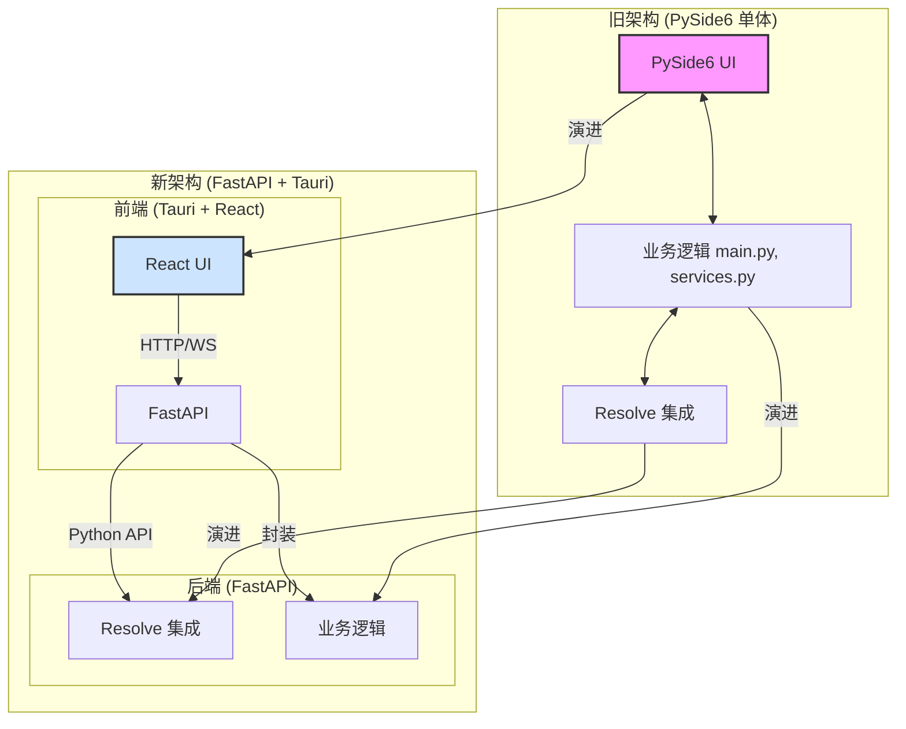
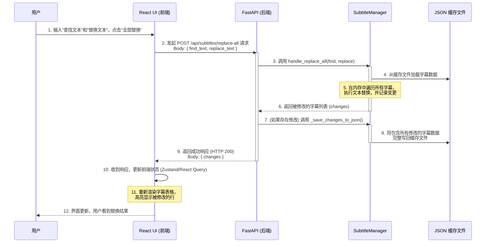
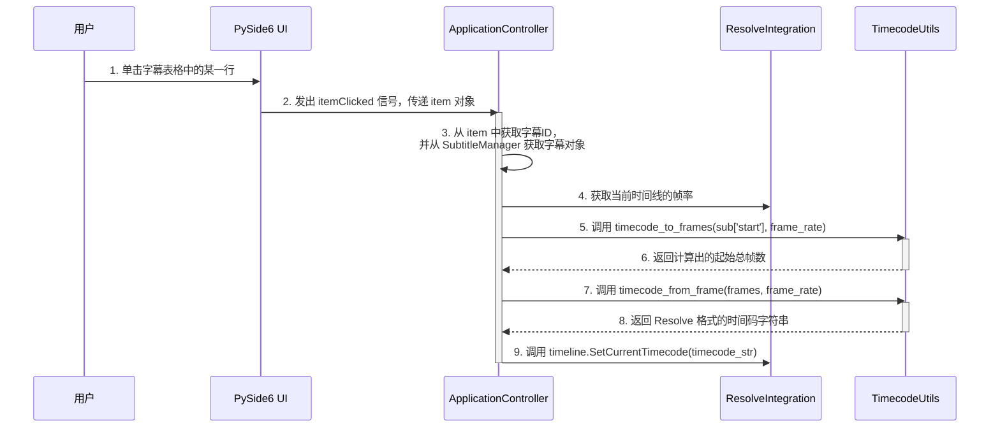
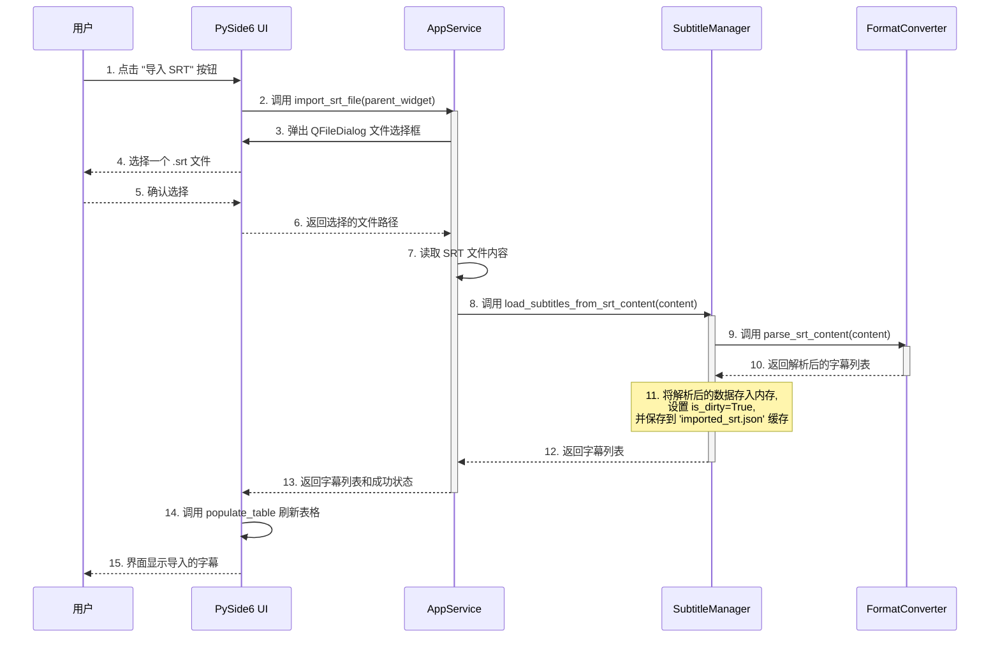

# 项目知识库：Subvigator Next

---

## 1. 项目概述 (Project Overview)

### 1.1 目标与愿景

**Subvigator Next** 是一个旨在革新视频剪辑中字幕处理工作流的专业工具，其核心目标是为 DaVinci Resolve 用户提供一个远超原生字幕功能的、高效且功能强大的字幕编辑器。

项目通过以下方式实现其价值：

*   **性能优化：** 解决了直接在 DaVinci Resolve 中处理大量字幕时（超过200条）出现的严重性能瓶颈。通过实现一套智能缓存机制，Subvigator 允许用户在外部编辑器中流畅地浏览和修改成百上千条字幕，而无需忍受 Resolve 的延迟。
*   **功能增强：** 提供了 Resolve 原生编辑器所缺乏的关键功能，例如：
    *   **高级查找与替换：** 支持对单条、多条或全部字幕进行精确的文本替换。
    *   **批量导入/导出：** 支持 SRT 格式的无缝导入和导出，便于与其他工具链协作。
    *   **直观的差异对比：** 在重新导入字幕时，能够清晰地高亮显示文本的变更，便于审核。
*   **现代化架构演进：** 本项目不仅是一个功能工具，更是一个技术演进的范例。它正在从一个基于 PySide6 的传统单体桌面应用，重构为一个采用 **FastAPI (后端) + React/Tauri (前端)** 的现代化、前后端分离的架构。这一转变旨在提升应用的可维护性、可扩展性和用户体验，并为未来引入更多复杂功能（如实时协作、云同步等）奠定坚实的基础。

### 1.2 目标用户

本项目主要服务于以下用户群体：

*   **专业视频剪辑师：** 每天需要处理大量对话、旁白和翻译字幕的影视后期专业人士。
*   **内容创作者/Youtuber：** 需要为其视频快速添加和编辑高质量字幕的内容生产者。
*   **字幕组/翻译团队：** 需要在视频制作流程中高效协作的团队。

### 1.3 技术栈概览

为实现上述目标，项目采用了以下技术栈：

*   **后端 (Business Logic & Resolve API)：**
    *   **语言:** Python 3
    *   **框架:** FastAPI (用于构建高性能的 RESTful API 和 WebSocket 服务)
    *   **核心库:** `DaVinciResolveScript` (用于与 DaVinci Resolve 进行原生交互)
*   **前端 (User Interface)：**
    *   **框架:** React (使用 Vite 进行构建)
    *   **语言:** TypeScript
    *   **桌面应用容器:** Tauri (基于 Rust，提供轻量、安全、跨平台的桌面应用打包方案)
    *   **UI组件库:** Shadcn/UI + Tailwind CSS
    *   **状态管理:** Zustand + TanStack Query (React Query)
*   **核心依赖:**
    *   `pydantic`: 用于数据验证和模型定义。
    *   `timecode`: 精确处理时间码与帧数之间的转换。


---

## 2. 架构详解 (Architecture Deep Dive)

本章节深入探讨 Subvigator Next 的系统架构，解释其核心设计理念，并展示这些理念是如何在代码层面得以实现的。

### 2.1 核心设计理念：从单体到分离的演进

项目架构的核心驱动力是 **从紧耦合的单体桌面应用向现代化、前后端分离的模式演进**。这一决策旨在解决原架构在可维护性、性能和用户体验方面的挑战。


```mermaid
graph TD
    subgraph "旧架构 (PySide6 单体)"
        direction LR
        UI[PySide6 UI] <--> Logic[业务逻辑 main.py, services.py]
        Logic <--> ResolveAPI[Resolve 集成]
    end

    subgraph "新架构 (FastAPI + Tauri)"
        direction LR
        subgraph "前端 (Tauri + React)"
            ReactUI[React UI] -- HTTP/WS --> FastAPI
        end
        subgraph "后端 (FastAPI)"
            FastAPI -- Python API --> ResolveAPI_New[Resolve 集成]
            FastAPI -- 封装 --> BusinessLogic[业务逻辑]
        end
    end

    UI --演进--> ReactUI
    Logic --演进--> BusinessLogic
    ResolveAPI --演进--> ResolveAPI_New

    style UI fill:#f9f,stroke:#333,stroke-width:2px
    style ReactUI fill:#cde4ff,stroke:#333,stroke-width:2px
```

*   **旧架构 (现状):** 所有UI渲染 (`PySide6`)、业务逻辑 (`services.py`) 和与DaVinci Resolve的通信 (`resolve_integration.py`) 都混合在同一个Python进程中。这种方式虽然简单，但导致了几个问题：
    *   **UI阻塞:** 任何耗时的后端操作（如获取上百条字幕）都会直接阻塞UI线程，导致界面卡顿。
    *   **技术栈陈旧:** `PySide6` 虽然功能强大，但在UI开发效率、社区生态和现代审美方面，与 `React` 等现代前端框架存在差距。
    *   **职责不清:** 代码职责划分不够清晰，UI逻辑与业务逻辑紧密耦合，难以维护和测试。

*   **新架构 (目标):** 新架构将应用彻底拆分为两个独立的部分：
    *   **后端 (FastAPI):** 一个纯粹的、无UI的Python服务，专门负责处理业务逻辑、与DaVinci Resolve通信，并通过标准的RESTful API和WebSocket对外提供服务。
    *   **前端 (Tauri + React):** 一个现代化的Web前端应用，负责所有用户界面的渲染和交互。它通过HTTP请求从后端获取数据，并通过Tauri提供的JavaScript API与原生系统（如文件对话框）交互。

这种分离带来了显而易见的好处：**解耦**。前端和后端可以独立开发、独立测试、独立部署，技术栈的选择也更加灵活。

### 2.2 模块划分与职责

新架构下的模块划分与职责更加清晰，这在未来的 `backend` 和 `frontend` 目录结构中得到了体现。

```mermaid
graph TD
    subgraph "用户桌面 (Tauri 环境)"
        TauriCore[Tauri Core (Rust)] -- 管理 --> FastAPIProcess(FastAPI 子进程)
        TauriCore -- 提供原生API --> ReactUI[React UI (WebView)]
        ReactUI -- API请求 --> FastAPIProcess
    end

    subgraph "后端服务 (FastAPI)"
        FastAPIProcess -- 封装 --> Services[业务服务层]
        Services -- 依赖 --> SubtitleManager[字幕管理器]
        Services -- 依赖 --> ResolveIntegration[Resolve集成]
        ResolveIntegration -- Python API --> DaVinciResolve[DaVinci Resolve]
    end

    style ReactUI fill:#cde4ff
    style TauriCore fill:#f9f
    style FastAPIProcess fill:#ffc
    style DaVinciResolve fill:#bbf
```

*   **Tauri Core (Rust):**
    *   **应用生命周期管理器:** 作为应用的入口，负责启动和关闭整个应用。
    *   **进程“保姆”:** 在后台以“Sidecar”模式启动并监控 FastAPI 子进程。它负责将配置文件中的端口、安全令牌等信息通过环境变量传递给后端。
    *   **原生桥梁:** 为前端提供访问操作系统原生功能的安全通道，如文件对话框。

*   **React UI (JavaScript/TypeScript):**
    *   **唯一的UI层:** 替换所有 `PySide6` 代码，负责渲染用户看到的所有内容。
    *   **API消费者:** 通过标准HTTP请求与本地FastAPI服务通信，实现业务功能。

*   **FastAPI 子进程 (Python):**
    *   **无头业务逻辑核心:** 包含了从旧 `src/` 目录迁移过来的所有核心业务逻辑。
    *   **API提供者:** 通过精心设计的API端点（REST + WebSocket）将业务能力暴露给前端。
    *   **Resolve的直接对话者:** 是应用中唯一与 DaVinci Resolve 的Python API直接通信的部分。

### 2.3 关键决策记录 (Architectural Decision Records - ADR)

#### ADR-001: 选择 FastAPI 作为后端框架

*   **背景:** 需要一个高性能、易于开发的Python框架来构建后端API。
*   **决策:** 选择 FastAPI。
*   **理由:**
    1.  **性能卓越:** 基于 Starlette 和 Pydantic，其性能在Python异步框架中名列前茅，足以应对实时数据交互。
    2.  **开发效率高:** 利用Python的类型提示，可以自动生成交互式的API文档（Swagger UI），极大地简化了API的调试和前后端联调过程。
    3.  **强大的依赖注入系统:** FastAPI的依赖注入系统使得管理服务实例（如 `SubtitleManager` 的单例）和处理横切关注点（如API Token验证）变得异常简单和优雅。
    4.  **异步支持:** 内置的 `async/await` 支持使得处理I/O密集型任务（如等待Resolve API响应）不会阻塞整个服务。

#### ADR-002: 选择 Tauri 作为桌面应用容器

*   **背景:** 需要一个方案将Web前端（React）打包成跨平台的桌面应用。
*   **决策:** 选择 Tauri，而不是更常见的 Electron。
*   **理由:**
    1.  **轻量与高性能:** Tauri 使用操作系统的原生WebView，而不是像Electron那样捆绑一个完整的Chromium浏览器。这使得最终的应用体积非常小（通常只有几MB），内存占用也极低。
    2.  **安全性:** Tauri的核心后端是用Rust编写的，这是一种内存安全的语言。它对前端能够调用的原生API有严格的控制，默认情况下不允许前端访问文件系统或执行任意代码，必须由开发者在Rust中明确授权，从而从根本上提高了应用的安全性。
    3.  **Sidecar模式:** Tauri原生支持将外部二进制文件（如我们用PyInstaller打包的FastAPI后端）作为“Sidecar”子进程打包和管理，完美契合我们的架构需求。

#### ADR-003: 完整保留 `SubtitleManager` 的缓存与 `is_dirty` 机制

*   **背景:** DaVinci Resolve 的脚本API在处理大量字幕时性能不佳，直接、频繁地调用会导致UI卡顿。
*   **决策:** 在重构到FastAPI后端时，必须完整、忠实地迁移并保留 `subtitle_manager.py` 中现有的文件缓存和 `is_dirty` 状态跟踪机制。
*   **理由:**
    1.  **性能基石:** 这是整个应用高性能体验的核心。**首次**加载某个字幕轨道时，应用会调用Resolve API获取全部字幕数据，并将其序列化为JSON文件，存储在本地临时目录（`subvigator_cache`）中。在后续的操作中，除非用户强制刷新，否则应用将**只读写这个缓存文件**，完全避免了与Resolve的慢速API交互。
    2.  **数据安全:** `is_dirty` 标志位是一个内存中的“脏标记”。当用户对字幕做出任何修改（编辑文本、替换等）时，这个标记会变为 `True`。只有当用户执行“重新导入到Resolve”或切换到另一轨道时，这些在缓存中的修改才会被写回Resolve或持久化。这确保了用户的修改不会因为意外退出而丢失，并在关键操作前提示用户保存。
    3.  **实现细节:** 在 `subtitle_manager.py` 中，`load_subtitles` 方法体现了**缓存优先**的逻辑，而 `update_subtitle_text`、`handle_replace_all` 等方法则负责维护 `is_dirty` 状态。这个模式必须在新的FastAPI服务中得到完整保留。


---

## 3. 核心模块与功能实现 (Core Modules & Functionality)

本章深入剖析构成应用核心能力的几个关键模块，并解释其主要功能的代码实现。

### 3.1 字幕管理器 (`subtitle_manager.py`)

这是整个应用的数据心脏，负责字幕数据的生命周期管理，是实现高性能编辑的关键。

*   **功能描述:**
    *   管理字幕数据的加载、缓存、查询和修改。
    *   通过 `is_dirty` 标志跟踪未保存的更改。
    *   支持从 Resolve 和 SRT 文件两种来源加载数据。

*   **代码入口:**
    *   旧架构: `src/subtitle_manager.py`
    *   新架构: `backend/app/services/subtitle_manager.py`

*   **关键逻辑与算法:**

    **1. 缓存优先的懒加载 (Lazy Loading with Cache-First):**
    `load_subtitles` 方法是理解此模块的关键。它并不总是直接请求 Resolve，而是优先从本地文件缓存中读取。

    ```python
    # src/subtitle_manager.py
    def load_subtitles(self, track_index):
        # 1. 确定当前轨道的缓存文件路径
        self.current_track_index = track_index
        file_path = os.path.join(self.cache_dir, f"track_{track_index}.json")
        self.current_json_path = file_path

        # 2. 检查缓存是否存在
        if not os.path.exists(file_path):
            # 3. 缓存未命中 (Cache Miss): 从 Resolve 获取数据
            print(f"LOG: INFO: Cache miss for track {track_index}. Fetching from Resolve.")
            json_data = self.resolve_integration.export_subtitles_to_json(track_number=track_index)
            if json_data is not None:
                # 4. 将从Resolve获取的数据写入缓存文件
                with open(file_path, 'w', encoding='utf-8') as f:
                    json.dump(json_data, f, ensure_ascii=False, indent=2)
                self.subtitles_data = json_data
            else:
                self.subtitles_data = []
        else:
            # 5. 缓存命中 (Cache Hit): 直接从JSON文件加载数据
            with open(file_path, 'r', encoding='utf-8') as f:
                self.subtitles_data = json.load(f)
        
        return self.subtitles_data
    ```
    *注释: 这个设计极大地提升了用户在已加载过的轨道之间切换的体验，从可能需要数秒的等待缩短到几乎瞬时完成。*

    **2. “脏”状态跟踪 (`is_dirty`):**
    这是一个简单的布尔标志，但至关重要。任何可能改变字幕数据的操作都会将此标志设置为 `True`。

    ```python
    # src/subtitle_manager.py
    def update_subtitle_text(self, item_id, new_text):
        # ... 查找并更新字幕对象 ...
        if sub_obj:
            sub_obj['text'] = new_text
            self._save_changes_to_json() # 将修改写入缓存
            self.is_dirty = True # <--- 核心：标记数据已变更
            return True
        return False

    def handle_replace_all(self, find_text, replace_text):
        # ... 批量替换 ...
        if changes:
            self.is_dirty = True # <--- 核心：标记数据已变更
        return changes
    ```
    *注释: 在UI层面，控制器会监听这个状态。当用户尝试执行可能导致数据丢失的操作（如刷新、切换轨道、关闭应用）时，会检查 `is_dirty` 状态，并弹出对话框提示用户“更改尚未同步到 Resolve，是否要放弃？”*

*   **API 接口 (新架构):**
    *   `GET /api/subtitles/{track_id}`: 获取指定轨道的字幕。
    *   `PUT /api/subtitles/{track_id}/{subtitle_id}`: 更新单条字幕。
    *   `POST /api/subtitles/replace-all`: 执行全部替换。
    *   `POST /api/subtitles/import-srt`: 从SRT文件导入。
    *   `GET /api/status/is-dirty`: (将通过WebSocket主动推送) 检查是否有未保存的修改。

### 3.2 Resolve 集成器 (`resolve_integration.py`)

该模块是应用与 DaVinci Resolve 之间的唯一桥梁，封装了所有底层的、可能不稳定的 Resolve 脚本 API 调用。

*   **功能描述:**
    *   动态查找并连接到 DaVinci Resolve 的脚本环境。
    *   提供安全、封装好的方法来获取时间线信息、读取字幕、设置当前时间码等。
    *   处理与 Resolve 通信时可能发生的各种异常。
    *   核心功能：**将 JSON 缓存文件重新导入回 Resolve**。

*   **代码入口:**
    *   旧架构: `src/resolve_integration.py`
    *   新架构: `backend/app/services/resolve_integration.py`

*   **关键逻辑与算法:**

    **重新导入字幕 (`reimport_from_json_file`):**
    这是整个流程的闭环，也是最复杂的操作之一。它将用户在缓存中做的所有修改应用回 DaVinci Resolve。

    ```python
    # src/resolve_integration.py
    def reimport_from_json_file(self, json_path):
        # ... 省略项目和媒体池的检查 ...
        try:
            # 1. 读取包含用户修改的 JSON 缓存文件
            with open(json_path, 'r', encoding='utf-8') as f:
                subtitle_data = json.load(f)

            # 2. 将 JSON 数据实时转换为 SRT 格式字符串
            #    这是因为 Resolve 的 API 只接受通过媒体池导入SRT文件，
            #    而不支持直接用脚本写入或修改大量字幕。
            frame_rate = float(self.timeline.GetSetting('timelineFrameRate'))
            timeline_start_frame = self.timeline.GetStartFrame()
            srt_content = convert_json_to_srt(json_path, frame_rate, offset_frames=timeline_start_frame)

            # 3. 将SRT内容写入一个临时的.srt文件
            with tempfile.NamedTemporaryFile(mode='w+', delete=False, suffix='.srt', encoding='utf-8') as tmp_srt_file:
                tmp_srt_file.write(srt_content)
                srt_file_path = tmp_srt_file.name

            try:
                # 4. 使用 Resolve API 将这个临时的SRT文件导入到媒体池
                imported_media = media_pool.ImportMedia([srt_file_path])
                subtitle_pool_item = imported_media[0]

                # 5. 在时间线上创建一个新的、干净的字幕轨道，并禁用其他轨道
                #    这是为了避免与原有字幕混淆，保证操作的原子性和可逆性。
                self.timeline.AddTrack("subtitle")
                new_track_count = self.timeline.GetTrackCount("subtitle")
                for i in range(1, new_track_count + 1):
                    self.timeline.SetTrackEnable("subtitle", i, i == new_track_count)
                
                # 6. 将媒体池中的字幕片段添加到新轨道上
                if not media_pool.AppendToTimeline(subtitle_pool_item):
                    return None, "Failed to append clip to the timeline."

                return True, None
            finally:
                # 7. 清理临时的SRT文件
                if os.path.exists(srt_file_path):
                    os.remove(srt_file_path)
        except Exception as e:
            return None, f"An unexpected exception occurred: {e}"
    ```
    *注释: 这个流程非常精妙。它通过 `JSON -> SRT -> 临时文件 -> 媒体池 -> 新轨道` 这一系列操作，巧妙地绕过了 Resolve API 在直接、批量修改字幕方面的限制，从而实现了将外部修改安全、可靠地同步回时间线的目标。*

*   **API 接口 (新架构):**
    *   `GET /api/timeline/tracks`: 获取字幕轨道列表。
    *   `GET /api/timeline/info`: 获取时间线信息。
    *   `POST /api/timeline/set-timecode`: 在 Resolve 中跳转播放头。
    *   `POST /api/subtitles/reimport-to-resolve`: 执行上述的重新导入流程。

#### **深度解析: `reimport_from_json_file`**

此功能是保证用户修改能够安全返回 DaVinci Resolve 的核心，其实现细节体现了对 Resolve API 限制的深入理解。

*   **核心挑战:** DaVinci Resolve 的脚本 API **没有提供** 直接在时间线上批量修改或插入字幕文本的有效方法。直接操作 `timeline.GetItemListInTrack()` 返回的对象并修改其 `Name` 属性，在实践中非常缓慢且不稳定。

*   **解决方案:** 我们采用了一种“曲线救国”的策略，即将我们的数据（JSON缓存）转换为 Resolve **原生支持** 的导入格式（SRT），然后利用其成熟的媒体导入流程。

*   **关键外部API依赖:**
    1.  **`format_converter.convert_json_to_srt(json_path, frame_rate, offset_frames)`:**
        *   **作用:** 将我们的内部数据模型（JSON）转换为外部标准格式（SRT）。
        *   **参数细节:**
            *   `json_path`: 要转换的缓存文件路径。
            *   `frame_rate`: 必须从 `timeline.GetSetting('timelineFrameRate')` 动态获取，以确保时间码计算的精确性。
            *   `offset_frames`: 这是一个关键参数，用于处理非零起始时间码的时间线。SRT格式的时间码总是从0开始，但Resolve的时间线可能从 `01:00:00:00` 开始。此偏移量（`timeline.GetStartFrame()`）用于校准两者之间的时间差。
    2.  **`tempfile.NamedTemporaryFile()`:**
        *   **作用:** 创建一个临时的 `.srt` 文件来存放转换后的内容。使用 `tempfile` 可以确保这个文件在操作系统层面是唯一的，并且在操作结束后会被自动清理，避免了手动管理临时文件带来的复杂性和潜在风险。
    3.  **`MediaPool.ImportMedia([srt_file_path])`:**
        *   **作用:** 这是 Resolve API 的一部分，用于将文件系统中的媒体文件导入到项目的媒体池中。这是将我们的字幕数据“送入”Resolve 的入口点。
    4.  **`Timeline.AddTrack("subtitle")` & `Timeline.SetTrackEnable(...)`:**
        *   **作用:** 我们选择在每次导入时都创建一个 **全新的、干净的字幕轨道**，并将其他轨道禁用。
        *   **错误处理机制:** 这是一个重要的 **防御性设计**。它确保了用户的原始字幕轨道永远不会被直接修改或破坏。如果导入过程因任何原因失败，用户原始的字幕轨道仍然完好无损，可以随时重新启用。这极大地提高了操作的安全性。
    5.  **`MediaPool.AppendToTimeline(clip)`:**
        *   **作用:** 将刚刚导入到媒体池的SRT片段，实际放置到新创建的字幕轨道上。

### 3.3 工具模块 (`format_converter.py` & `timecode_utils.py`)

除了核心的服务模块，项目中还包含两个至关重要的底层工具模块，它们为上层逻辑提供了基础的转换和计算能力。

*   **`FormatConverter` (`format_converter.py`):**
    *   **功能描述:** 负责 **SRT (SubRip Text)** 格式字符串与项目内部JSON数据结构之间的双向转换。
    *   **关键方法:**
        *   `parse_srt_content(srt_content: str) -> list`: 接收一个完整的SRT文件内容字符串，通过正则表达式和字符串分割，将其解析成一个包含 `index`, `start`, `end`, `text` 的字典列表。这是实现“SRT导入”功能的基石。
        *   `format_subtitles_to_srt(subtitles: list, ...)`: 接收字幕字典列表，并将其格式化为符合SRT标准的字符串。这是实现“重新导入到Resolve”和未来可能“导出为SRT”功能的核心。

*   **`TimecodeUtils` (`timecode_utils.py`):**
    *   **功能描述:** 封装了所有与时间码相关的复杂计算，提供了一个静态工具类来处理帧数和不同时间码格式（`HH:MM:SS,ms` for SRT, `HH:MM:SS:FF` for Resolve）之间的换算。
    *   **关键方法:**
        *   `timecode_to_frames(time_str, frame_rate)`: 将时间码字符串转换为总帧数。
        *   `timecode_from_frame(frame, frame_rate)`: 将总帧数转换为 Resolve 使用的 `HH:MM:SS:FF` 格式的时间码字符串。
        *   `timecode_to_srt_format(frame, frame_rate)`: 将总帧数转换为 SRT 文件使用的 `HH:MM:SS,ms` 格式的时间码字符串。
    *   **重要性:** 该模块将项目中所有涉及到时间计算的逻辑集中于一处，极大地提高了代码的可维护性和准确性，避免了在多个地方重复编写复杂的转换算法。

### 3.4 UI模块 (PySide6 - 旧架构)

尽管新架构将采用 React 重建前端，但理解旧 `PySide6` UI的构成对于功能复刻至关重要。

*   **`ui.py` (`SubvigatorWindow`):** 主窗口，负责整体布局，并包含了字幕表格 (`QTreeWidget`)。它定义了 `subtitleDataChanged` 等关键的自定义信号，用于与控制器通信。
*   **`inspector_panel.py`:** 右侧的“检查器”面板，包含了轨道选择下拉框、筛选/查找/替换的输入框和按钮。
*   **`ui_logic.py`:** 包含了一些UI的业务逻辑，例如 `filter_tree` 方法，它根据检查器中的文本过滤主表格中的内容。
*   **`ui_model.py`:** 定义了用于在 `QTreeWidget` 中展示字幕数据的模型。
*   **`ui_components.py`:** 包含了一些自定义的UI组件，如可编辑的表格项。

#### **深度解析: `reimport_from_json_file`**

此功能是保证用户修改能够安全返回 DaVinci Resolve 的核心，其实现细节体现了对 Resolve API 限制的深入理解。

*   **核心挑战:** DaVinci Resolve 的脚本 API **没有提供** 直接在时间线上批量修改或插入字幕文本的有效方法。直接操作 `timeline.GetItemListInTrack()` 返回的对象并修改其 `Name` 属性，在实践中非常缓慢且不稳定。

*   **解决方案:** 我们采用了一种“曲线救国”的策略，即将我们的数据（JSON缓存）转换为 Resolve **原生支持** 的导入格式（SRT），然后利用其成熟的媒体导入流程。

*   **关键外部API依赖:**
    1.  **`format_converter.convert_json_to_srt(json_path, frame_rate, offset_frames)`:**
        *   **作用:** 将我们的内部数据模型（JSON）转换为外部标准格式（SRT）。
        *   **参数细节:**
            *   `json_path`: 要转换的缓存文件路径。
            *   `frame_rate`: 必须从 `timeline.GetSetting('timelineFrameRate')` 动态获取，以确保时间码计算的精确性。
            *   `offset_frames`: 这是一个关键参数，用于处理非零起始时间码的时间线。SRT格式的时间码总是从0开始，但Resolve的时间线可能从 `01:00:00:00` 开始。此偏移量（`timeline.GetStartFrame()`）用于校准两者之间的时间差。
    2.  **`tempfile.NamedTemporaryFile()`:**
        *   **作用:** 创建一个临时的 `.srt` 文件来存放转换后的内容。使用 `tempfile` 可以确保这个文件在操作系统层面是唯一的，并且在操作结束后会被自动清理，避免了手动管理临时文件带来的复杂性和潜在风险。
    3.  **`MediaPool.ImportMedia([srt_file_path])`:**
        *   **作用:** 这是 Resolve API 的一部分，用于将文件系统中的媒体文件导入到项目的媒体池中。这是将我们的字幕数据“送入”Resolve 的入口点。
    4.  **`Timeline.AddTrack("subtitle")` & `Timeline.SetTrackEnable(...)`:**
        *   **作用:** 我们选择在每次导入时都创建一个 **全新的、干净的字幕轨道**，并将其他轨道禁用。
        *   **错误处理机制:** 这是一个重要的 **防御性设计**。它确保了用户的原始字幕轨道永远不会被直接修改或破坏。如果导入过程因任何原因失败，用户原始的字幕轨道仍然完好无损，可以随时重新启用。这极大地提高了操作的安全性。
    5.  **`MediaPool.AppendToTimeline(clip)`:**
        *   **作用:** 将刚刚导入到媒体池的SRT片段，实际放置到新创建的字幕轨道上。

### 3.3 工具模块 (`format_converter.py` & `timecode_utils.py`)

除了核心的服务模块，项目中还包含两个至关重要的底层工具模块，它们为上层逻辑提供了基础的转换和计算能力。

*   **`FormatConverter` (`format_converter.py`):**
    *   **功能描述:** 负责 **SRT (SubRip Text)** 格式字符串与项目内部JSON数据结构之间的双向转换。
    *   **关键方法:**
        *   `parse_srt_content(srt_content: str) -> list`: 接收一个完整的SRT文件内容字符串，通过正则表达式和字符串分割，将其解析成一个包含 `index`, `start`, `end`, `text` 的字典列表。这是实现“SRT导入”功能的基石。
        *   `format_subtitles_to_srt(subtitles: list, ...)`: 接收字幕字典列表，并将其格式化为符合SRT标准的字符串。这是实现“重新导入到Resolve”和未来可能“导出为SRT”功能的核心。

*   **`TimecodeUtils` (`timecode_utils.py`):**
    *   **功能描述:** 封装了所有与时间码相关的复杂计算，提供了一个静态工具类来处理帧数和不同时间码格式（`HH:MM:SS,ms` for SRT, `HH:MM:SS:FF` for Resolve）之间的换算。
    *   **关键方法:**
        *   `timecode_to_frames(time_str, frame_rate)`: 将时间码字符串转换为总帧数。
        *   `timecode_from_frame(frame, frame_rate)`: 将总帧数转换为 Resolve 使用的 `HH:MM:SS:FF` 格式的时间码字符串。
        *   `timecode_to_srt_format(frame, frame_rate)`: 将总帧数转换为 SRT 文件使用的 `HH:MM:SS,ms` 格式的时间码字符串。
    *   **重要性:** 该模块将项目中所有涉及到时间计算的逻辑集中于一处，极大地提高了代码的可维护性和准确性，避免了在多个地方重复编写复杂的转换算法。

### 3.4 UI模块 (PySide6 - 旧架构)

尽管新架构将采用 React 重建前端，但理解旧 `PySide6` UI的构成对于功能复刻至关重要。

*   **`ui.py` (`SubvigatorWindow`):** 主窗口，负责整体布局，并包含了字幕表格 (`QTreeWidget`)。它定义了 `subtitleDataChanged` 等关键的自定义信号，用于与控制器通信。
*   **`inspector_panel.py`:** 右侧的“检查器”面板，包含了轨道选择下拉框、筛选/查找/替换的输入框和按钮。
*   **`ui_logic.py`:** 包含了一些UI的业务逻辑，例如 `filter_tree` 方法，它根据检查器中的文本过滤主表格中的内容。
*   **`ui_model.py`:** 定义了用于在 `QTreeWidget` 中展示字幕数据的模型。
*   **`ui_components.py`:** 包含了一些自定义的UI组件，如可编辑的表格项。


---

## 4. 数据流与状态管理 (Data Flow & State Management)

本章旨在阐明数据在应用内部的流动路径以及关键状态的管理方式。

### 4.1 主要业务流程: "查找并全部替换"

我们以“查找并全部替换”这个核心功能为例，来追踪一次完整的用户操作在 **新架构** 下的数据流转过程。


```mermaid
sequenceDiagram
    participant User as 用户
    participant ReactUI as React UI (前端)
    participant FastAPI as FastAPI (后端)
    participant SubManager as SubtitleManager
    participant Cache as JSON 缓存文件

    User->>ReactUI: 1. 输入"查找文本"和"替换文本"，点击"全部替换"
    ReactUI->>FastAPI: 2. 发起 POST /api/subtitles/replace-all 请求<br>Body: { find_text, replace_text }
    
    activate FastAPI
    FastAPI->>SubManager: 3. 调用 handle_replace_all(find, replace)
    activate SubManager
    SubManager->>Cache: 4. 从缓存文件加载字幕数据
    Note over SubManager: 5. 在内存中遍历所有字幕，<br>执行文本替换，并记录变更
    SubManager-->>FastAPI: 6. 返回被修改的字幕列表 (changes)
    deactivate SubManager
    
    FastAPI->>SubManager: 7. (如果存在修改) 调用 _save_changes_to_json()
    activate SubManager
    SubManager->>Cache: 8. 将包含所有修改的字幕数据<br>完整写回缓存文件
    deactivate SubManager
    
    FastAPI-->>ReactUI: 9. 返回成功响应 (HTTP 200)<br>Body: { changes }
    deactivate FastAPI
    
    ReactUI->>ReactUI: 10. 收到响应，更新前端状态 (Zustand/React Query)
    Note over ReactUI: 11. 重新渲染字幕表格，<br>高亮显示被修改的行
    ReactUI-->>User: 12. 界面更新，用户看到替换结果
```

**流程详解:**

1.  **用户操作:** 用户在 React 界面的输入框中填入需要查找和替换的文本，然后点击“全部替换”按钮。
2.  **前端请求:** React UI 组件的事件处理器被触发。它会从状态管理器（Zustand）中获取输入值，然后使用 `fetch` 或 `axios` 库，向本地运行的 FastAPI 服务发起一个 `POST` 请求。
3.  **后端接收:** FastAPI 的路由函数 (`/api/subtitles/replace-all`) 接收到该请求，并通过 Pydantic 模型验证请求体的合法性。
4.  **调用服务:** 路由函数调用注入的 `SubtitleManager` 实例的 `handle_replace_all` 方法。
5.  **内存操作:** `SubtitleManager` 首先确保字幕数据已从 **JSON缓存文件** 加载到内存中。然后，它遍历内存中的字幕列表，执行字符串替换，并将所有发生变更的字幕（包括旧文本和新文本）记录在一个 `changes` 列表中。
6.  **返回变更:** `handle_replace_all` 方法将 `changes` 列表返回给 FastAPI 路由。
7.  **持久化修改:** 路由函数检查 `changes` 列表是否为空。如果不为空，它会调用 `SubtitleManager` 的 `_save_changes_to_json` 方法。
8.  **写入缓存:** `_save_changes_to_json` 方法会将 **整个**、**最新的** 字幕数据（包含所有已应用的修改）序列化，并完整地覆盖写入到对应的 `track_{index}.json` 缓存文件中。同时，`is_dirty` 标志被设置为 `True`。
9.  **后端响应:** FastAPI 向前端返回一个成功的 HTTP 响应，响应体中包含了 `changes` 列表，以便前端知道哪些字幕被修改了。
10. **前端状态更新:** 前端的数据请求库（TanStack Query）接收到响应。它的 `onSuccess` 回调被触发，可能会使相关的查询缓存失效，并用新的数据更新UI。
11. **UI重新渲染:** React 根据更新后的状态，重新渲染字幕表格组件。它可以利用响应中的 `changes` 数据，对刚刚被修改的行应用特殊的样式（如高亮、闪烁）以提示用户。
12. **用户感知:** 用户在界面上看到文本被成功替换。

#### 4.1.1 业务流程补充: "点击跳转时间码"

除了“查找替换”，另一个核心交互是用户在UI上点击某条字幕，播放头自动跳转到相应位置。


```mermaid
sequenceDiagram
    participant User as 用户
    participant UI as PySide6 UI
    participant Controller as ApplicationController
    participant Resolve as ResolveIntegration
    participant TCUtils as TimecodeUtils

    User->>UI: 1. 单击字幕表格中的某一行
    UI->>Controller: 2. 发出 itemClicked 信号，传递 item 对象
    activate Controller
    Controller->>Controller: 3. 从 item 中获取字幕ID，<br>并从 SubtitleManager 获取字幕对象
    Controller->>Resolve: 4. 获取当前时间线的帧率
    Controller->>TCUtils: 5. 调用 timecode_to_frames(sub['start'], frame_rate)
    activate TCUtils
    TCUtils-->>Controller: 6. 返回计算出的起始总帧数
    deactivate TCUtils
    Controller->>TCUtils: 7. 调用 timecode_from_frame(frames, frame_rate)
    activate TCUtils
    TCUtils-->>Controller: 8. 返回 Resolve 格式的时间码字符串
    deactivate TCUtils
    Controller->>Resolve: 9. 调用 timeline.SetCurrentTimecode(timecode_str)
    deactivate Controller
```

#### 4.1.2 业务流程补充: "SRT导入"


```mermaid
sequenceDiagram
    participant User as 用户
    participant UI as PySide6 UI
    participant Service as AppService
    participant SubManager as SubtitleManager
    participant Converter as FormatConverter

    User->>UI: 1. 点击 "导入 SRT" 按钮
    UI->>Service: 2. 调用 import_srt_file(parent_widget)
    activate Service
    Service->>UI: 3. 弹出 QFileDialog 文件选择框
    UI-->>User: 4. 选择一个 .srt 文件
    User-->>UI: 5. 确认选择
    UI-->>Service: 6. 返回选择的文件路径
    Service->>Service: 7. 读取 SRT 文件内容
    Service->>SubManager: 8. 调用 load_subtitles_from_srt_content(content)
    activate SubManager
    SubManager->>Converter: 9. 调用 parse_srt_content(content)
    activate Converter
    Converter-->>SubManager: 10. 返回解析后的字幕列表
    deactivate Converter
    Note over SubManager: 11. 将解析后的数据存入内存, <br>设置 is_dirty=True, <br>并保存到 'imported_srt.json' 缓存
    SubManager-->>Service: 12. 返回字幕列表
    deactivate SubManager
    Service-->>UI: 13. 返回字幕列表和成功状态
    deactivate Service
    UI->>UI: 14. 调用 populate_table 刷新表格
    UI-->>User: 15. 界面显示导入的字幕
```

#### 4.1.1 业务流程补充: "点击跳转时间码"

除了“查找替换”，另一个核心交互是用户在UI上点击某条字幕，播放头自动跳转到相应位置。


```mermaid
sequenceDiagram
    participant User as 用户
    participant UI as PySide6 UI
    participant Controller as ApplicationController
    participant Resolve as ResolveIntegration
    participant TCUtils as TimecodeUtils

    User->>UI: 1. 单击字幕表格中的某一行
    UI->>Controller: 2. 发出 itemClicked 信号，传递 item 对象
    activate Controller
    Controller->>Controller: 3. 从 item 中获取字幕ID，<br>并从 SubtitleManager 获取字幕对象
    Controller->>Resolve: 4. 获取当前时间线的帧率
    Controller->>TCUtils: 5. 调用 timecode_to_frames(sub['start'], frame_rate)
    activate TCUtils
    TCUtils-->>Controller: 6. 返回计算出的起始总帧数
    deactivate TCUtils
    Controller->>TCUtils: 7. 调用 timecode_from_frame(frames, frame_rate)
    activate TCUtils
    TCUtils-->>Controller: 8. 返回 Resolve 格式的时间码字符串
    deactivate TCUtils
    Controller->>Resolve: 9. 调用 timeline.SetCurrentTimecode(timecode_str)
    deactivate Controller
```

### 4.2 数据库模型

本项目不涉及传统的关系型或NoSQL数据库。其核心的“数据库”就是位于本地临时目录 (`subvigator_cache`) 下的一系列 **JSON 文件**。

*   **`track_{index}.json`:** 每个字幕轨道对应一个JSON文件。这是对 Resolve 中字幕数据的一份完整快照。
*   **`imported_srt.json`:** 当用户通过SRT文件导入字幕时，会创建一个特殊的缓存文件来存储这些数据。

每个JSON文件的结构如下：

```json
[
  {
    "index": 1,
    "start": "01:00:00,000",
    "end": "01:00:02,500",
    "text": "这是第一条字幕。"
  },
  {
    "index": 2,
    "start": "01:00:03,120",
    "end": "01:00:05,800",
    "text": "这是第二条字幕。"
  }
]
```

这种以文件作为数据库的策略，对于桌面单机应用来说非常有效，它避免了引入外部数据库服务的复杂性，同时提供了足够好的性能和数据持久性。

### 4.3 状态管理机制

状态管理是确保UI与数据同步、应用行为可预测的关键。在新架构中，状态被明确地分为两类：

*   **服务器状态 (Server State):**
    *   **定义:** 指源自后端、被视为“事实来源”的数据。在本项目中，这包括字幕列表、轨道列表、时间线信息等。
    *   **管理工具:** **TanStack Query (React Query)**。
    *   **工作方式:** React Query 负责处理与服务器状态相关的所有事情：发起API请求、缓存响应数据、自动在后台重新获取数据以保持新鲜、管理加载和错误状态。开发者只需要简单地调用一个自定义Hook（如 `useSubtitles(trackId)`），就能以声明式的方式获取、使用和更新服务器数据，而无需手动编写复杂的 `useEffect` 和 `useState` 逻辑。

*   **客户端状态 (Client State):**
    *   **定义:** 指纯粹属于UI、与后端数据无直接关联的状态。例如，搜索框的输入文本、当前选中的下拉菜单项、查找/替换输入框的内容、某个面板是否展开等。
    *   **管理工具:** **Zustand**。
    *   **工作方式:** Zustand 提供一个全局的、轻量级的 store 来存放这些UI状态。任何组件都可以订阅 store 中的特定状态，当该状态发生变化时，只有订阅了该状态的组件会重新渲染，从而实现了高效、精确的UI更新。

这种将服务器状态和客户端状态分开管理的策略，是现代React开发的最佳实践。它使得数据流向更加清晰，代码结构更有条理，并极大地减少了无谓的样板代码。


---

## 5. 环境搭建与部署 (Setup & Deployment)

本章提供在本地设置开发环境以及将应用打包部署的详细指南。

### 5.1 本地开发环境

要在本地成功运行和开发 Subvigator Next，需要分别设置后端和前端的开发环境。

**先决条件:**

*   **Node.js:** (版本 >= 18.0)
*   **Rust:** 通过 `rustup` 安装
*   **Python:** (版本 >= 3.9)
*   **DaVinci Resolve:** 已安装并可以正常运行

**后端 (FastAPI) 设置:**

1.  **导航到后端目录:**
    ```bash
    cd backend
    ```

2.  **创建并激活虚拟环境:** (强烈推荐)
    ```bash
    # Windows
    python -m venv venv
    .\venv\Scripts\activate

    # macOS / Linux
    python3 -m venv venv
    source venv/bin/activate
    ```

3.  **安装 Python 依赖:**
    ```bash
    pip install -r requirements.txt
    ```

4.  **运行后端开发服务器:**
    ```bash
    uvicorn app.main:app --reload
    ```
    现在，FastAPI 后端服务将在 `http://127.0.0.1:8000` 上运行。你可以访问 `http://127.0.0.1:8000/docs` 查看并测试自动生成的 API 文档。

**前端 (Tauri + React) 设置:**

1.  **导航到前端目录:**
    ```bash
    cd frontend
    ```

2.  **安装 NPM 依赖:**
    ```bash
    npm install
    ```

3.  **运行前端开发服务器:**
    ```bash
    npm run tauri dev
    ```
    这个命令会同时做两件事：
    *   启动 Vite 前端开发服务器，提供热重载功能。
    *   启动 Tauri 应用窗口，它会自动加载 Vite 服务器提供的页面内容。

    > **注意:** 在开发模式下，Tauri 不会为你管理 FastAPI 后端进程。你需要 **手动、独立地** 在两个不同的终端中分别运行后端和前端的启动命令。

### 5.2 部署流程

将应用打包成一个可供最终用户使用的独立可执行文件，是发布的最后一步。这得益于 Tauri 和 PyInstaller 的强大功能。

**核心流程:**

1.  **打包后端为可执行文件:**
    我们使用 `PyInstaller` 将整个 FastAPI 应用（包括其所有Python依赖）打包成一个单一的、无依赖的可执行文件。
    ```bash
    # 在 backend 目录下
    pyinstaller --name subvigator_backend --onefile --windowed app/main.py
    ```
    这会在 `backend/dist` 目录下生成一个 `subvigator_backend.exe` (或对应系统的) 文件。

2.  **配置 Tauri Sidecar:**
    接下来，我们需要告诉 Tauri 将这个打包好的后端作为“Sidecar”捆绑进最终的应用包中。
    编辑 `frontend/src-tauri/tauri.conf.json` 文件：
    ```json
    {
      "tauri": {
        "bundle": {
          "externalBin": [
            "../backend/dist/subvigator_backend"
          ]
        }
      }
    }
    ```

3.  **在 Rust 中管理 Sidecar 生命周期:**
    我们需要修改 Tauri 的 Rust 核心代码，让它在应用启动时启动我们的后端，在应用退出时关闭它。
    编辑 `frontend/src-tauri/src/main.rs`:
    ```rust
    use tauri::api::process::{Command, CommandEvent};

    fn main() {
        tauri::Builder::default()
            .setup(|app| {
                // 启动 sidecar
                let (mut rx, mut child) = Command::new_sidecar("subvigator_backend")
                    .expect("failed to create `subvigator_backend` command")
                    .spawn()?;

                // 监听 sidecar 的 stdout/stderr，用于调试
                tauri::async_runtime::spawn(async move {
                    while let Some(event) = rx.recv().await {
                        if let CommandEvent::Stdout(line) = event {
                            println!("Backend: {}", line);
                        }
                    }
                });

                // 在窗口关闭时，确保子进程被终止
                let window = app.get_window("main").unwrap();
                let child_clone = child.clone();
                window.on_window_event(move |event| {
                    if let tauri::WindowEvent::Destroyed = event {
                        child_clone.kill().expect("Failed to kill backend process");
                    }
                });

                Ok(())
            })
            .run(tauri::generate_context!())
            .expect("error while running tauri application");
    }
    ```

4.  **构建最终应用:**
    完成以上配置后，在 `frontend` 目录下运行最终的构建命令：
    ```bash
    npm run tauri build
    ```
    Tauri 会完成所有工作：构建和优化 React 前端、编译 Rust 核心、将后端可执行文件捆绑进来，并最终在 `frontend/src-tauri/target/release/bundle/` 目录下生成适用于你当前操作系统的安装包（如 `.msi` for Windows, `.dmg` for macOS）。


---

## 6. 代码规范与贡献指南 (Contribution Guide & Best Practices)

为确保项目的长期健康发展和代码库的一致性，所有贡献者都应遵循以下规范。

### 6.1 编码风格

*   **后端 (Python):**
    *   **格式化:** 严格遵循 **PEP 8** 规范。推荐使用 `black` 作为代码格式化工具，以实现完全一致的风格。
    *   **类型提示:** 所有函数和方法的定义都 **必须** 包含类型提示 (Type Hinting)，遵循 **PEP 484**。这是 FastAPI 自动生成文档和进行数据验证的基础。
    *   **命名约定:**
        *   变量和函数名: `snake_case` (例如: `load_subtitles`)
        *   类名: `PascalCase` (例如: `SubtitleManager`)
        *   常量: `UPPER_SNAKE_CASE` (例如: `API_TOKEN`)

*   **前端 (TypeScript/React):**
    *   **格式化:** 推荐使用 `Prettier` 来自动格式化代码。
    *   **命名约定:**
        *   组件: `PascalCase` (例如: `SubtitleTable.tsx`)
        *   变量和函数: `camelCase` (例如: `fetchSubtitles`)
        *   自定义Hooks: 以 `use` 开头 (例如: `useSubtitles`)
    *   **组件定义:** 优先使用函数式组件 (Functional Components) 和 Hooks，避免使用类组件 (Class Components)。

### 6.2 测试要求

高质量的测试是保证重构和功能迭代稳定性的关键。

*   **后端测试:**
    *   **框架:** 使用 `pytest`。
    *   **位置:** 所有测试代码都应放在 `backend/tests/` 目录下。
    *   **要求:**
        *   **单元测试:** 核心业务逻辑（尤其是在 `SubtitleManager` 和 `FormatConverter` 中）必须有单元测试覆盖。
        *   **集成测试:** API 端点应有集成测试，使用 `FastAPI.TestClient` 来模拟 HTTP 请求，并验证响应是否符合预期。测试应覆盖成功路径和常见的错误路径。
    *   **运行测试:**
        ```bash
        # 在 backend 目录下
        pytest
        ```

*   **前端测试:**
    *   **框架:** 使用 `Vitest` 和 `React Testing Library`。
    *   **要求:**
        *   **单元测试:** 针对复杂的自定义 Hooks 和工具函数编写单元测试。
        *   **组件测试:** 针对核心的、交互复杂的组件（如 `SubtitleTable`, `FindReplaceGroup`）编写测试，验证其在不同 props 和用户交互下的渲染和行为是否正确。
    *   **运行测试:**
        ```bash
        # 在 frontend 目录下
        npm test
        ```

### 6.3 分支与合并策略

我们采用一种简化的、基于 **GitHub Flow** 的分支模型。

1.  **`main` 分支:**
    *   `main` 分支是项目的主分支，它 **永远** 代表着最新的、稳定的、可发布的代码。
    *   **严禁** 直接向 `main` 分支推送代码。

2.  **特性分支 (Feature Branches):**
    *   当你开始开发一个新功能或修复一个 Bug 时，**必须** 从 `main` 分支创建一个新的特性分支。
    *   分支命名应具有描述性，建议使用 `feature/功能描述` 或 `fix/问题描述` 的格式。
        *   `feature/add-websocket-support`
        *   `fix/timecode-calculation-error`

3.  **拉取请求 (Pull Request - PR):**
    *   当你的特性分支开发完成后，向 `main` 分支发起一个 Pull Request。
    *   在 PR 的描述中，清晰地说明你做了什么、为什么这么做，以及如何测试。
    *   **PR 必须通过所有自动化检查** (如 CI/CD 流水线中的代码检查和自动化测试)，才能被合并。
    *   至少需要 **一名** 其他团队成员的代码审查 (Code Review) 并批准，PR 才能被合并。

4.  **合并与清理:**
    *   PR 被批准并合并到 `main` 分支后，应删除已合并的特性分支，以保持仓库的整洁。

这个流程确保了 `main` 分支的稳定性，并通过代码审查和自动化测试保证了代码质量。
