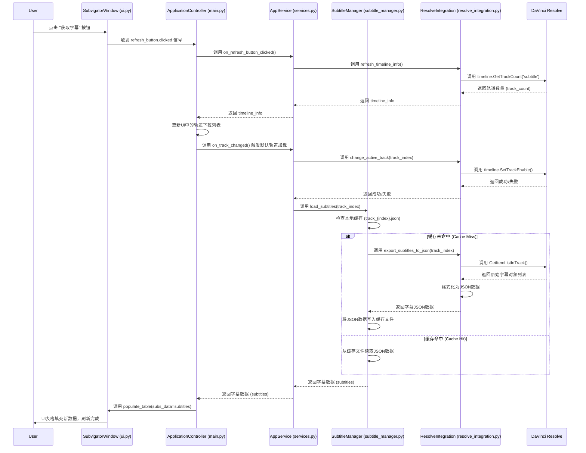

# 数据流图：刷新轨道字幕

本文档旨在通过序列图（Sequence Diagram）详细阐述用户在 Subvigator 应用中执行“刷新轨道字幕”操作时的完整端到端数据流。

## 参与者（Actors/Participants）

- **User**: 应用的最终用户。
- **SubvigatorWindow (ui.py)**: 用户界面层，负责接收用户输入和展示数据。
- **ApplicationController (main.py)**: 应用控制器，作为UI和后端服务之间的协调者。
- **AppService (services.py)**: 应用服务层，封装核心业务逻辑。
- **SubtitleManager (subtitle_manager.py)**: 字幕数据管理器，负责字幕的加载、缓存和处理。
- **ResolveIntegration (resolve_integration.py)**: 与 DaVinci Resolve API 交互的集成层。
- **DaVinci Resolve**: 外部视频编辑软件，是数据的最终来源。

## 序列图 (Mermaid)

## 关键步骤解释

1.  **用户触发**: 流程始于用户在 `SubvigatorWindow` 中点击“获取字幕”按钮。
2.  **信号传递**: UI层通过信号 (`clicked`) 通知 `ApplicationController` 用户执行了操作。
3.  **服务调用**: `ApplicationController` 调用 `AppService` 中的 `refresh_timeline_info` 方法，开始获取时间线信息。
4.  **API交互**: `AppService` 将请求委托给 `ResolveIntegration`，后者直接调用 DaVinci Resolve 的 API (`GetTrackCount`) 来获取字幕轨道的数量。
5.  **轨道切换与加载**: 获取到轨道信息后，Controller 会触发默认轨道的加载流程。`AppService` 首先通过 `ResolveIntegration` 激活目标轨道，然后调用 `SubtitleManager` 的 `load_subtitles` 方法。
6.  **缓存检查 (核心)**: `SubtitleManager` 是数据加载的核心。它首先检查是否存在该轨道的本地JSON缓存。
    *   **缓存命中**: 如果存在，则直接从本地文件读取数据，避免了与 Resolve 的直接通信，提高了效率。
    *   **缓存未命中**: 如果不存在，`SubtitleManager` 会请求 `ResolveIntegration` 从 Resolve 中导出字幕 (`export_subtitles_to_json`)，然后将获取到的数据写入本地JSON文件作为缓存，以备后续使用。
7.  **数据返回**: `SubtitleManager` 将加载好的字幕数据层层返回给 `ApplicationController`。
8.  **UI更新**: `ApplicationController` 最终调用 `SubvigatorWindow` 的 `populate_table` 方法，将获取到的字幕数据填充到UI表格中，用户最终看到更新后的字幕列表。
